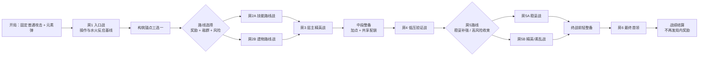
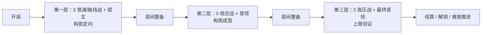

# 《元素地牢》关卡流程竞品探测与适配设计报告

> 文档性质：竞品探测 / 关卡流程提案  
> 调研对象：《哈迪斯》《死亡细胞》《梦之形》《失落城堡》（初代）  
> 项目口径：当前 Godot 4.7.1 原型；“4.7”是引擎版本，不是游戏版本号  
> 调研日期：2026-08-03  
> 本轮边界：只生成报告，不修改任何项目代码、场景或资源

## 0. 结论先行

当前项目最适合的不是《死亡细胞》式大规模连续地图，也不是直接复制《梦之形》的追猎者系统，而是采用一套“**固定层级骨架 + 房间级透明分支 + 策划房模板随机组合**”的流程。

推荐先把现有六房原型收束为一局约 **16～22 分钟**的“两层六房流程”:

```text
入口战（建立操作）
→ 构筑锚点三选一
→ 路线战（技能 / 遗物）
→ 层主精英战
→ 中段整备
→ 构筑验证战
→ 高风险收束战
→ 最终首领
→ 结算复盘
```

这套结构分别吸收：

- 《哈迪斯》的“门上明示奖励、频繁但轻量的下一房决策”；
- 《死亡细胞》的“区域分层、层间整备、不同路线对应不同风险结构”；
- 《梦之形》的“为了多拿构筑资源而承担额外风险”，但把全局追猎压力降级为可选的高风险房；
- 《失落城堡》的“线性闯关易理解、房间内容与掉落随机、每层以首领收束”。

《元素地牢》自己的核心不应变成“在地图上算最优路线”，而应始终是：

> **观察敌人与地形 → 选择当前元素 → 决定叠层、异色反应或回收 → 管理能量与走位 → 用房间奖励修正下一次元素决策。**

最重要的流程修正有三项：

1. 第一房奖励不再只是三个随机合法技能，而应保证出现不同构筑职能，让玩家在前 3～5 分钟形成“高频反应 / 深层爆发 / 单元素收益或资源回收”之一的方向。
2. 路线选择不能只写“技能 / 遗物”，还应同时明示遭遇强度、敌群特征和额外条件，使选择同时包含“想拿什么”和“愿意怎么打”。
3. 最终首领后不得再发只能在本局生效的技能或遗物；应直接进入战绩结算。当前“第六房奖励 → 第二次商店 → 结束”的原型节奏会产生无效奖励，应在后续实现任务中调整。

---

## 1. 研究口径与当前项目事实

### 1.1 调研方法

本报告交叉使用：

- 项目内当前策划、交接稿和 `RunDirector` / `RouteState` 只读检查；
- 开发商、发行商或 Steam 官方页面；
- 官方 Wiki；
- 当官方资料没有描述节点细节时，以多个社区流程资料交叉验证。

“来源事实”只描述资料直接支持的内容；“设计判断”是对这些结构为何有效、是否适合本项目的推导，不宣称为原作开发者的设计原意。本轮没有以完整长时实机录像做逐帧统计，因此不采用原作精确平均房间时长、掉落概率或最优路线作为本项目数值依据。

### 1.2 当前项目已经具备的基础

根据项目内《当前玩法设计交接稿》《技能、遗物与局内成长系统策划案》及现有状态机：

| 范围 | 当前事实 |
| --- | --- |
| 可直接游玩 | 单个 `TestRoom`；横板移动、跳跃、普通攻击、技能释放、手动元素切换、单个兽人敌人 |
| 元素系统 | 当前正式内容只有水、火；各最多 10 层；异元素按 1:1 消耗，每实际消耗一层使本次伤害倍率增加 30% |
| 战斗构筑 | 固定普通攻击；共享 `ACTIVE_1～3 + PASSIVE_1`；元素变化不更换配装 |
| 当前内容 | 元素弹初始拥有；其余 5 个可获取技能；3 件正式遗物；角色等级、属性点、技能拥有库与商店换装 |
| 流程底层 | `COMBAT → REWARD → ROUTE_CHOICE → COMBAT / SHOP`；每 3 个战斗房进入商店；原型计数为 6 个战斗房 |
| 尚未完成 | 完整连续换房、正式地牢生成、复杂房型、首领、正式货币、跨局永久成长 |

因此，本报告把“**可用现有系统验证的流程**”和“**内容扩充后的目标流程**”分开，不把后者误写为当前实现。

### 1.3 现有六房状态机的设计缺口

当前底层很好地保证了房间完成、奖励、路线和商店事务的权威性，但它仍是流程骨架，不是完整关卡体验：

- `RouteOption` 目前只区分奖励房与商店，奖励路线只有技能或遗物，没有遭遇类型、风险、区域和房间预览信息。
- 商店严格按第 3、6 个战斗房触发，不能表达“中段整备”和“最终首领后直接结算”的不同语义。
- 第 6 房完成后仍会先领取局内奖励、再进入商店并结束；如果没有后续战斗，最后一次技能、遗物、加点和换装都没有验证窗口。
- 当前正式技能总量很小且同名技能每局只获取一次，若扩成长流程仍保持“每房必发技能”，奖励池会迅速耗尽。

这些不是现有代码的缺陷，而是原型状态机进入关卡制作前需要补齐的产品规则。

---

## 2. 四款参考游戏的关卡流程与核心循环

## 2.1 《哈迪斯》：固定大骨架中的高频透明选择

### 来源事实

- 单局沿塔耳塔洛斯、阿斯福德、至福乐土、冥河神殿四个主要区域推进；区域顺序固定，每区以守关战或特殊终段收束。[Hades 官方 Steam 页面](https://store.steampowered.com/app/1145360/Hades/)、[区域概览](https://en.wikipedia.org/wiki/Hades_%28video_game%29)
- 大多数房间清敌后领取奖励；下一扇门会显示房间奖励图标，玩家在进入前知道自己选择的是神祇祝福、金币、生命上限、强化或跨局资源。高危险房会用骷髅标记。[Chambers and Encounters](https://hades.fandom.com/wiki/Chambers_and_Encounters)、[Chamber Reward](https://hades.fandom.com/wiki/Chamber_Reward)
- 区域之间有安全楼梯间，提供恢复、临时商店、出售祝福和更换信物等整备机会。[Chambers and Encounters](https://hades.fandom.com/wiki/Chambers_and_Encounters)
- 单局祝福形成大量组合；死亡后回到冥府之家，通过夜之圣镜等系统永久成长，并继续推进角色叙事。[Hades 官方 Steam 页面](https://store.steampowered.com/app/1145360/Hades/)、[Supergiant 官方 FAQ](https://www.supergiantgames.com/blog/hades-faq/)
- 通关后通过惩罚契约主动叠加挑战条件，而不是只选择一个简单的“敌人血量倍率”。[Supergiant 更新说明](https://www.supergiantgames.com/blog/hades-welcome-to-hell-update-patch-notes/)

### 核心循环

```text
选武器 / 信物与局外配置
→ 进入房间战斗
→ 领取可预期类型的奖励
→ 比较下一扇门
→ 逐步形成神祇祝福联动
→ 区域首领
→ 区间整备
→ 最终失败或通关
→ 回到基地成长、叙事与再挑战
```

### 对本项目最有价值的点

《哈迪斯》的路线并不要求玩家理解一张复杂地图。它把决策压缩到“下一房想要什么”，非常适合当前已有的 `REWARD → ROUTE_CHOICE` 结构。最值得迁移的是**信息透明度和决策频率**，不是四区域数量、神祇体系或美术表现。

### 不宜照搬

- 当前元素地牢的技能、遗物池远小于《哈迪斯》的祝福池，不能每房都靠三选一维持新鲜度。
- 项目核心是主动切换元素和附着层决策，不应让大量被动祝福把胜负主要转移到自动触发与数值叠加。

## 2.2 《死亡细胞》：宏观路线分叉与连续探索节奏

### 来源事实

- 游戏由多个生物群落组成。关卡层级和大致连接关系预先确定，但同一层通常可在不同生物群落之间选择；每个群落内部按其参数程序生成。[Official Dead Cells Wiki：Biomes](https://deadcells.wiki.gg/wiki/Biomes)
- 群落有独立敌人、陷阱、商店、宝藏和数值强度；符文与 Boss Stem Cell 会开放额外路径、房间或区域。[Official Dead Cells Wiki：Biomes](https://deadcells.wiki.gg/wiki/Biomes)
- 离开群落后进入 Passage：提交蓝图与细胞、重铸装备、选择或更换变异、补充生命；首领后的 Passage 还有传奇熔炉。[Official Dead Cells Wiki：Passage](https://deadcells.wiki.gg/wiki/Passage)
- Passage 内存在计时门、连杀或无伤门等奖励，使快速推进与稳定清怪成为可选表现目标。[Official Dead Cells Wiki：Biomes](https://deadcells.wiki.gg/wiki/Biomes)
- Boss Stem Cell 逐级提高敌人等级、密度、种类并逐步削减恢复资源，也会开放额外路径；难度改变的不只是生命和伤害。[Official Dead Cells Wiki：Boss Stem Cell](https://deadcells.wiki.gg/wiki/Boss_Stem_Cell)
- 官方将其核心概括为探索不断变化的城堡，在永久死亡威胁下掌握 2D 战斗：“Kill, die, learn, repeat.”[Dead Cells 官方网站](https://deadcells.com/)

### 核心循环

```text
随机初始装备
→ 连续探索生物群落
→ 击杀、找卷轴、武器与蓝图
→ 在出口选择下一群落
→ Passage 消费、换变异与恢复
→ 首领
→ 更高层群落
→ 死亡丢失本局装备，但保留已解锁内容
```

### 对本项目最有价值的点

- “区域路线”和“房间内路线”可以分层：玩家不需要每个小房都打开大地图，但每一层结束时应知道下一层敌人生态、危险与收益差异。
- 层间整备是清晰的节奏换气点，适合承载项目现有的属性点分配和共享技能栏调整。
- 高难度应优先改变敌人组合、恢复条件和危险规则，而不是简单堆血。

### 不宜照搬

- 当前项目没有足够的区域、敌人、平台块与移动能力，直接制作大规模程序生成连续地图会放大卡死、回溯和横板碰撞质量风险。
- 计时奖励不能成为主规则；元素附着、回收和蓄层需要思考时间，全面追求速度会压扁这些决策。

## 2.3 《梦之形》：探索贪心、追猎压力与技能—修饰物耦合

### 来源事实

- 官方资料列出 8 名旅行者、150+ 记忆与精华、9 个清醒梦修饰器和 8 个世界；每局的选择与变量会变化。[Shape of Dreams 官方 Steam 页面](https://store.steampowered.com/app/2444750/Shape_of_Dreams/)
- 记忆是主动能力，精华可以插入并改变能力的伤害、元素、冷却、治疗或行为；构筑重点是把多个修饰集中到核心能力，而非只换一把更高数值的武器。[官方商店页](https://store.steampowered.com/app/2444750/Shape_of_Dreams/)、[Memory / Essence 机制说明](https://games.gg/shape-of-dreams/guides/shape-of-dreams-key-memory-and-essence/)
- 每个世界使用节点地图；节点对应独立战斗区域，清敌后通过裂隙移动。玩家可以绕路探索更多节点，但追猎者会逐步逼近并使相关战斗更强，最终目标是到达首领节点并进入下一世界。该流程由多个社区流程资料交叉支持。[地图流程评测](https://steamcommunity.com/id/sosich24/recommended/2444750/)、[节点与追猎系统拆解](https://vortexgaming.io/en/postdetail/544371)
- 节点可能包含恢复神龛、梦尘井、商人、精英、诅咒、重随或品质提升等功能；官方后续更新继续增加“用代价换取构筑选择”的神龛和高风险奖励。[节点图标指南](https://steamcommunity.com/sharedfiles/filedetails/?id=3574214693)、[官方 v1.2 更新公告](https://steamcommunity.com/app/2444750/announcements/)
- 官方持续用不同难度与清醒梦规则改变构筑条件和战术要求，而非只提供单一固定难度。[Shape of Dreams 官方 Steam 页面](https://store.steampowered.com/app/2444750/Shape_of_Dreams/)

### 核心循环

```text
选择旅行者与难度规则
→ 在节点图上决定探索方向
→ 清场、收集记忆 / 精华 / 梦尘
→ 强化或重组核心能力
→ 判断是否为了高价值节点多走一步
→ 承担追猎者与诅咒压力
→ 世界首领
→ 进入下一世界并继续放大构筑
```

### 对本项目最有价值的点

- 它证明“技能本体 + 可改变行为的修饰”能形成比纯数值升级更强的构筑辨识度。元素地牢已有技能、遗物和元素策略三层，可以用房间路线帮助玩家补齐组合，而不必立刻增加技能等级。
- 真正有效的路线张力不是分叉数量，而是“多拿一次资源是否值得多承担一次危险”。

### 不宜照搬

- 全局追猎者会要求地图占领、回溯、节点传播和多人同步等整套系统，超出当前原型目标。
- 大量重随、品质、商人和节点功能会与当前“无货币、无技能等级、无品质”的冻结规则冲突。

本项目可先把追猎压力转译成**单房可选的紊乱挑战**：玩家主动进入更危险的房间，换取第三个候选、额外经验或更稳定的构筑相关项；不制作在地图上持续移动的追兵。

## 2.4 《失落城堡》：线性闯关骨架上的房间与掉落随机

### 来源事实

- 初代《失落城堡》是横向卷轴动作 RPG / Beat'em up Roguelite，支持最多四人；官方强调随机地牢、物品、敌人、首领，以及大量武器、装备、药水、技能和特殊攻击。[Lost Castle 官方 Steam 页面](https://store.steampowered.com/app/434650/Lost%20Castle/)
- 每局从牢房以随机角色外观和随机初始武器开始；死亡后返回牢房，用战斗中获得的恶魔灵魂推进天赋树。[流程评测](https://gamefaqs.gamespot.com/pc/186399-lost-castle/reviews/174434)、[天赋资料](https://lostcastle.fandom.com/zh/wiki/%E5%A4%A9%E8%B5%8B)
- 大流程按关卡顺序推进，各区域由不同形状、内容与顺序的房间组成，普通房清理后获得物品或宝箱，区域末端为首领房。[关卡与房间评测](https://www.geeksundergrace.com/gaming/review-lost-castle-switch/)
- 第一关“哥布林塔楼”明确包含起始牢房、战斗房、隐藏房和关底首领房；后续关卡提高装备产出等阶。[关卡资料](https://lostcastle.fandom.com/zh/wiki/%E5%93%A5%E5%B8%83%E6%9E%97%E5%A1%94%E6%A5%BC)、[物品随关卡等阶](https://lostcastle.fandom.com/zh/wiki/%E5%9C%BA%E6%99%AF%E7%89%A9%E5%93%81)

### 核心循环

```text
随机角色 / 武器开局
→ 横向清理随机房间
→ 捡武器、护甲、消耗品并随局适应
→ 区域首领
→ 进入更高阶区域
→ 死亡返回牢房
→ 用恶魔灵魂解锁天赋后再开一局
```

### 对本项目最有价值的点

- 横板动作游戏不需要一开始就有复杂路线图；只要大目标清晰，房间顺序、敌群和掉落的受控随机就能支撑重复游玩。
- 房间内的战斗节奏和捡到“这局就试试看”的内容，比复杂地图规划更贴近当前项目开发能力。

### 不宜照搬

- 随机初始武器会削弱元素切换作为稳定核心教学的地位；元素弹和固定普通攻击应继续作为可靠开局基线。
- 当前没有武器、护甲和消耗品的大型掉落池，不能依靠高频换装备制造变化。

---

## 3. 横向比较与迁移结论

| 维度 | 哈迪斯 | 死亡细胞 | 梦之形 | 失落城堡 | 元素地牢采用 |
| --- | --- | --- | --- | --- | --- |
| 大流程 | 固定区域顺序 | 层级固定、群落分叉 | 8 世界节点推进 | 线性关卡推进 | 固定层级骨架 |
| 小路线 | 门上显示奖励 | 群落内探索与出口 | 节点探索、相邻揭示 | 房间/分支随机 | 每房 2 个透明路线 |
| 风险张力 | 骷髅房、混沌门、惩罚契约 | 诅咒、限时/无伤门、高难资源削减 | 追猎者、诅咒、高价值绕路 | 随机敌群、首领、资源消耗 | 可选精英/紊乱房，暂不做追兵 |
| 构筑单位 | 神祇祝福 + 武器强化 | 武器/技能 + 卷轴 + 变异 | 记忆 + 精华 + 星盘 | 武器/装备/道具 | 技能 + 遗物 + 元素反应 + 属性 |
| 整备节拍 | 区域间楼梯间 | Passage | 商店/神龛节点 | 区域内随机功能房 | 每层末整备，终战前轻整备 |
| 局外循环 | 永久成长 + 叙事 | 内容解锁 + 难度细胞 | 解锁角色/内容/规则 | 天赋树 | 暂缓永久数值，先做流程闭环 |
| 最值得借鉴 | 高频透明选择 | 分层与整备 | 贪心—风险与能力修饰 | 低认知成本的随机闯关 | “串珠式分支地牢” |

建议采用的关卡形态可概括为：

> **《失落城堡》的线性可读性作为骨架，《哈迪斯》的门牌奖励作为房间选择，《死亡细胞》的层级与整备作为中段节拍，《梦之形》的风险换构筑完整度作为可选深度。**

---

## 4. 元素地牢的核心循环定义

## 4.1 战斗内 5～15 秒微循环

```text
判断敌人类型与已有附着
→ 选择水或火
→ 用普通攻击控位 / 用技能施加元素
→ 决定继续叠层、异色引爆，或用回收换能量
→ 在动作前摇、能量和敌方预警之间找安全窗口
→ 反应结果改变下一次元素与技能选择
```

房间设计必须持续提出这个问题，而不是只提高敌人血量。敌群应轮流测试：

- 能否安全叠层；
- 能否在多目标之间分配附着；
- 能否保留单元素层给燃烧、不息或回收；
- 能否在高压窗口及时切换元素并完成反应；
- 能否避免把全部能量用在错误时机。

## 4.2 60～150 秒房间循环

```text
看路线门牌
→ 预判奖励、敌群与风险
→ 进入策划房模板
→ 完成主目标和可选表现目标
→ 结算经验
→ 领取并比较奖励
→ 立即在下一房验证变化
```

## 4.3 16～22 分钟原型单局循环

```text
建立操作基线
→ 获得第一构筑锚点
→ 补主动能力或遗物条件
→ 第一层精英验证
→ 中段加点与换装
→ 第二层放大构筑
→ 最终首领综合验证
→ 结算“这局为何有效 / 死在哪里”
```

## 4.4 暂缓的局外循环

当前不建议立刻加入永久攻击、生命或元素倍率树。关卡闭环稳定前，永久数值会掩盖房间曲线、奖励质量和元素反应问题。

若后续增加局外进度，优先顺序应是：

1. 解锁新技能、遗物、房间、首领变体；
2. 解锁可选难度规则和起始构筑侧重；
3. 叙事、图鉴和挑战记录；
4. 最后才考虑小幅永久数值。

---

## 5. 推荐方案 A：两层六房原型流程

这是当前最值得先做的版本。它复用“六个战斗房 + 中段商店 + 技能/遗物奖励”大部分概念，但重新定义每个房间的体验职责。



### 5.1 房间职责表

| 节点 | 目标时长 | 战斗职责 | 奖励职责 | 失败后应学到什么 |
| --- | ---: | --- | --- | --- |
| 房 1：入口战 | 60～90 秒 | 复习移动、普通攻击、元素弹、手动切换与 1～2 层反应 | 固定“构筑职能三选一” | 是否理解同色叠层、异色消耗 |
| 房 2：路线战 | 75～110 秒 | 用敌群差异验证玩家刚选的能力 | 按路线给技能或遗物 | 新能力何时用、是否缺能量或续航 |
| 房 3：层主精英 | 120～180 秒 | 第一次要求稳定完成元素决策，不允许纯普攻轻易磨过 | 给互补奖励，之后进入商店 | 构筑最明显的短板是什么 |
| 中段整备 | 60～120 秒 | 无战斗 | 分配属性点、调整共享 3+1 配装、查看遗物 | 为什么这样换装 |
| 房 4：低压验证 | 75～110 秒 | 给新配装一个安全验证窗口 | 常规技能/遗物或稳定经验 | 加点与换装是否真的改变打法 |
| 房 5：收束战 | 100～160 秒 | 让玩家选择稳妥补强或高风险冲上限 | 最后一次有效局内奖励 | 最终 Boss 前还缺输出、生存还是能量 |
| 终战前轻整备 | 20～45 秒 | 无战斗，不新增属性点经济 | 仅允许查看并调整已拥有技能；提供受控恢复 | 明确最终配装与战术 |
| 房 6：最终首领 | 180～300 秒 | 综合测试切元素、叠层/反应、能量与危险预警 | 只发结算、首通标记或未来局外解锁 | 明确死因和构筑表现 |

### 5.2 第一房“构筑锚点三选一”

第一房不应随机给出三个功能高度相似的选项。候选生成应覆盖三个不同职能：

| 职能 | 当前内容示例 | 希望形成的打法 |
| --- | --- | --- |
| 主动输出 / 叠层 | 元素激光、元素之怒 | 持续叠层或高能量爆发 |
| 资源与层数操作 | 回收 | 在保留附着与换取能量之间决策 |
| 单元素收益 / 生存 | 燃烧、不息 | 不立即触发异色反应，保留火层或水层 |

这不是要求固定发某三个 ID，而是要求“第一组候选至少让玩家看见不同的战斗循环”。元素弹继续作为稳定开局基线，不需要随机武器开局。

### 5.3 路线门牌信息

每个路线选择必须同时显示四类信息：

```text
主奖励：技能 / 遗物 / 补给 / 特殊机会
遭遇：群怪 / 远程压制 / 精英 / 首领
环境：平台结构或危险标签
风险收益：普通、危险，及额外候选或额外经验
```

示例：

```text
[技能残响]  群怪 · 双层平台 · 普通危险
[遗物残响]  精英 · 狭长地面 · 候选 +1
```

玩家因此不是在两个不同颜色的按钮之间猜测，而是在决定：“我想补技能，但要打群怪；我也可以冒更高风险拿遗物和更完整的候选。”

### 5.4 为什么只设一次完整商店

六房原型中，房 3 后的商店有明确价值：玩家已经拿到约 3 次奖励和若干属性点，且后面仍有三场战斗验证修改。

房 6 后的第二次商店没有战斗价值，建议从正式体验中移除。终战前只需要一个轻整备点，让玩家调整已拥有技能并获得受控恢复；是否分配新属性点仍遵守“不能在战斗中加点”的现有规则，但不再让终局操作变成无效提交。

---

## 6. 房间模板与受控随机

## 6.1 不先做随机平台拼接

横板动作的地面高度、单向平台、跳跃距离、攻击碰撞和敌人寻路高度耦合。首版应使用**策划验证过的完整房间模板**，再随机：

- 本局抽到哪张模板；
- 敌人组合与出场顺序；
- 路线奖励类型；
- 是否附加精英或紊乱条件；
- 宝箱、恢复点或特殊互动位置。

不要在 MVP 阶段随机拼接地板和平台块。随机性应先作用于“战斗问题的组合”，而不是作用于“玩家能不能正常跳过去”。

## 6.2 首批房间几何原型

| 几何原型 | 主要战斗问题 | 适合敌群 | 元素决策作用 |
| --- | --- | --- | --- |
| 平地决斗场 | 读招、拉扯、近身/远程切换 | 单精英 + 少量援军 | 观察单目标叠层与爆发窗口 |
| 双层平台场 | 上下层换位、投射物角度 | 近战追击 + 远程单位 | 在多目标间分配附着，利用激光穿透 |
| 双端压迫场 | 左右夹击、清场顺序 | 两侧刷新或高低混编 | 决定先堆单侧还是快速异色清杂 |
| 狭长走廊 | 直线威胁、空间压缩 | 冲锋、投射物、Beam 可穿透目标 | 强化元素激光和范围技能的定位差异 |
| 首领专用场 | 预警可读、阶段转换 | 固定首领 | 不用随机地形干扰机制学习 |

首批环境危险应保持无元素偏向，避免火房天然奖励火、惩罚水或相反。等土、电和环境元素载体进入正式内容后，再设计可被元素改变的水池、火源、导电地面或可破坏设施。

## 6.3 标准战斗房节拍

```text
3～5 秒：进入、看清敌群与地形
20～35 秒：第一组敌人，提出单一问题
5～10 秒：位置重置或短暂掉落
30～50 秒：第二组敌人，将两个问题组合
3～5 秒：确认清场、恢复镜头与交互
20～40 秒：奖励阅读和路线选择
```

普通房目标战斗时间为 60～100 秒；精英房 100～160 秒；首领 180～300 秒。早期不追求每房三波以上，避免战斗内容少时靠重复刷怪拉长时长。

---

## 7. 敌群、精英与首领如何服务元素核心

## 7.1 敌群职责，而不是单纯数值档位

首批敌人可按战斗职责组织：

- **追击者**：迫使玩家移动，打断无脑原地引导；
- **远程压制者**：制造切层和优先击杀；
- **厚甲目标**：给多层反应或高能量爆发明确价值；
- **脆弱杂兵**：给范围、连穿、燃烧传播或击杀收益发挥空间；
- **干扰者**：短暂改变安全区，但不直接禁用元素或技能。

每个普通房只组合 2～3 种职责。第一层先单独教学，第二层再交叉组合。

## 7.2 第一层精英：附着与反应检查

建议的层主精英只检查一个核心能力：

- 常态可受正常伤害；
- 某个明显蓄力阶段获得可被多层水火反应快速打破的稳定护甲；
- 玩家可以用任意方向的水→火或火→水完成，不设置单元素免疫；
- 未完成反应也能继续战斗，但会面对更长危险阶段。

它让玩家理解“多层反应是主动破局工具”，同时不把未成型构筑判死刑。

## 7.3 最终首领：三项综合检查

最终首领应依次测试：

1. **元素规划**：首领的大动作前有足够时间让玩家叠层，并在窗口中异色反应；
2. **能量规划**：不能把全部能量花在普通阶段，否则会错过破绽；
3. **切换与快照理解**：玩家需要知道已经生成的技能锁定释放时元素，后续切换用于准备下一招，而不是改变空中的攻击。

不建议使用：

- 对水或火完全免疫；
- 强制清空全部元素附着且没有预告；
- 大量不可控召唤物让附着目标随机分散；
- 把首领主要难度做成高血量长时间重复。

首领每个阶段只新增一个规则，最后阶段再组合，而不是第一秒同时开启全部机制。

---

## 8. 奖励节奏与风险收益规则

## 8.1 奖励不必每房都是新技能

当前正式池只有 6 个可获取技能、3 件遗物，且同名内容每局只获取一次。六房原型尚可测试，但目标流程必须减少“每房一个永久局内内容”的密度。

建议把房间产出分成：

- **主奖励**：技能或遗物，改变构筑；
- **稳定成长**：击杀经验、房间经验、属性点；
- **恢复与修整**：生命、能量或换装机会；
- **挑战加成**：额外候选、构筑相关保底或额外经验，不新增货币也能产生贪心选择。

## 8.2 候选数量可承担风险奖励

在不增加品质和重随的前提下，可采用：

- 第一房固定 3 个职能不同的技能候选；
- 后续普通路线基础 2 个候选；
- 精英或可选挑战成功后增加至 3 个；
- 技能池或遗物池耗尽时，权威路线生成器直接移除该路线，不用重复内容填位。

这样既复用现有“最多三选一”的结构，也能形成《梦之形》式“为了构筑完整度多承担风险”的张力。

## 8.3 可选表现目标

优先使用与元素玩法一致的目标：

- 本房触发若干次有效异元素反应；
- 单次反应实际消耗达到指定层数；
- 使用回收获得指定能量；
- 在保留某元素层数的情况下击败目标；
- 以低能量或不使用恢复完成精英战。

限时与无伤可以少量存在，但不作为所有房间的通用最高收益条件。元素玩法需要“何时不反应”的取舍，不能被统一秒表强迫成只求最快伤害。

## 8.4 反坏运气保护

- 第一房候选必须跨职能，不允许三个都只做相似伤害。
- 连续两次没有与当前已拥有内容形成联动的候选时，下一次至少出现一个可用联动项。
- 联动保底只保证“可用”，不保证最高稀有度，也不锁死转型。
- 若玩家只有元素弹一个主动技能，首个商店前至少有一次获得主动技能的明确机会。
- 最终首领前不再给无法装备、无法触发或没有后续验证机会的内容。

---

## 9. 推荐方案 B：内容扩充后的三层目标流程

当内容达到下列最低规模后，再把六房原型扩成约 **25～32 分钟**的三层流程：

- 12～16 个可获取技能；
- 10～15 件遗物；
- 每层至少 3 类普通敌人、2 类精英和 1 个层主；
- 每层至少 6 个验证过的房间模板；
- 至少 3 类非技能产出节点，避免奖励池耗尽。



三层的职责不是简单“怪越来越硬”：

| 层级 | 主要问题 | 路线差异 | 首领职责 |
| --- | --- | --- | --- |
| 第一层：构筑定向 | 我这局围绕什么操作循环 | 技能与遗物，安全与精英 | 检查基础叠层和反应 |
| 第二层：构筑成型 | 如何补能量、生存、单体或清群短板 | 敌群生态和房间风险开始明显分化 | 检查两项机制组合 |
| 第三层：上限验证 | 是否愿意用生命/恢复/候选稳定性冲上限 | 稳妥终战路线或紊乱高收益路线 | 综合检查并结束本局 |

后续若加入土、电，不应简单变成四条互斥元素路线。路线应描述“本层会更多测试建造物、传播、控制或反应窗口”，仍允许玩家用不同元素组合通过。

---

## 10. 难度与重复游玩

### 10.1 优先做规则难度

参考惩罚契约、Boss Stem Cell 和清醒梦，后续高难度可逐项启用：

- 精英词缀增加；
- 敌群职责提前混编；
- 恢复量减少或恢复点变少；
- 房间附加一个可预知危险；
- 首领增加新招式或更早进入组合阶段；
- 路线信息更少一项，但不隐藏主奖励；
- 可选紊乱房收益更高，失败代价更明显。

不要只用“敌人生命 +50%、伤害 +50%”作为全部难度变化。

### 10.2 暂不制作全局追猎者

若六房与三层流程验证后仍缺少贪心压力，可以加入“**层内紊乱值**”：

- 玩家主动选择紊乱房后，本层后续房间增加一个可预览修饰；
- 每层最多叠加 2 次，进入整备点时清空；
- 每次紊乱保证额外候选、额外经验或特殊遗物机会；
- 玩家可以完全不走紊乱路线并正常通关。

它保留《梦之形》的“多拿一步就更危险”，但不需要实现移动追兵、节点占领和回溯传播。

---

## 11. 需要记录和验证的指标

本阶段不设商业化或留存目标，只验证玩法与流程是否成立。

| 验证问题 | 建议记录 |
| --- | --- |
| 第一房是否建立方向 | 三个候选职能、选择项、选择耗时；玩家能否口述打法 |
| 元素机制是否真的参与通关 | 每房水/火附着、实际反应消耗层数、回收能量、单元素保留时长 |
| 路线是否有意义 | 各路线选择率、路线完成率、放弃高风险路线的原因 |
| 房间是否拖沓 | 进房至清场时间、波次间空白、最后一名敌人定位时间 |
| 奖励是否过密 | 奖励界面停留时间、无联动候选率、奖励池耗尽房号 |
| 商店是否改变打法 | 商店前后配装差异、属性点提交、下一房技能使用变化 |
| Boss 是否验证构筑 | 阶段到达率、死亡招式、元素反应次数、能量为空的持续时间 |
| 本局是否可复盘 | 结算后玩家能否回答“这局强在哪里、为什么死” |

建议的原型验收线：

- 5 名首次接触完整流程的内部测试者中，至少 4 名能在房 2 后说出自己的当前构筑方向；
- 房 1～5 每 2～3 分钟至少发生一次有意义的战斗或路线决策；
- 普通房中位战斗时长控制在 60～100 秒，且“寻找最后一个敌人”不成为主要耗时；
- 安全与高风险路线长期选择率都不低于 25%，否则很可能是假选择；
- 最终首领死亡原因能对应明确机制，而不是“血太多、看不清或没有输出”；
- 最终首领后不出现只能服务本局、却没有下一场战斗可验证的奖励或加点。

---

## 12. 后续制作顺序建议

### P0：锁定纸面规则

- 确认六房职责、第一房候选职能、房 6 后直接结算；
- 确认路线门牌字段；
- 确认一只层主精英和一只最终首领分别检查什么；
- 不扩土、电，不做程序生成地图。

### P1：六房可玩闭环

- 使用 3～4 张普通策划房、1 张精英房、1 张首领房；
- 完成真实换房、奖励、路线、中段商店、终战前轻整备和结算；
- 继续使用当前水、火、6 技能和 3 遗物验证节奏。

### P2：风险与房间变化

- 增加敌群职责、可选表现目标和“候选 +1”高风险路线；
- 增加 2～3 个房间模板和首领变体；
- 用数据判断是否需要层内紊乱值。

### P3：三层目标局

- 内容池达到最低规模后扩至三层；
- 引入区域敌群、事件/补给节点和规则型高难度；
- 最后再评估局外解锁、土电元素与环境交互。

### 未来实现时需要调整的流程边界

本轮不改代码。正式排实现任务时，应重点评审：

1. `RunDirector` 是否把“商店间隔”和“本局结束条件”从固定房数中解耦；
2. `RouteOption` 是否需要只读的房间预览、风险、遭遇和奖励元数据；
3. 最终首领是否走独立的 `BOSS / RUN_COMPLETE` 语义，避免再次生成局内奖励；
4. 房间模板、敌群配置和奖励规则如何保持静态配置与 `RunSession` 运行状态分离；
5. 奖励权威仍由 `RunSession` 控制，UI 只展示和请求，不能因为门牌预览自行生成奖励。

---

## 13. 最终建议

建议团队把下一阶段的关卡目标定为：

> **先做一局短而完整、每个房间都验证元素决策的“两层六房地牢”，而不是先做一张大而随机的地图。**

判断方案成功的标准不是“像四款参考游戏中的哪一款”，而是以下体验能否连续发生：

1. 玩家用元素弹学会水火附着；
2. 第一奖励让他主动选择一种操作循环；
3. 路线把“想拿的奖励”和“愿打的风险”绑定；
4. 中段整备让共享 3+1 配装产生一次明确变化；
5. 精英和首领要求玩家真正使用叠层、反应、回收和能量窗口；
6. 结算能解释这局的构筑与死因，并自然引出下一局。

在这条闭环成立之前，完整程序生成、全局追猎者、跨局数值树和更多元素都不是最优先项。

---

## 14. 主要来源

### 《哈迪斯》

- [Hades 官方 Steam 页面](https://store.steampowered.com/app/1145360/Hades/)
- [Supergiant Games：Hades FAQ](https://www.supergiantgames.com/blog/hades-faq/)
- [Hades Wiki：Chambers and Encounters](https://hades.fandom.com/wiki/Chambers_and_Encounters)
- [Hades Wiki：Chamber Reward](https://hades.fandom.com/wiki/Chamber_Reward)
- [Supergiant Games：Welcome to Hell / Pact of Punishment](https://www.supergiantgames.com/blog/hades-welcome-to-hell-update-patch-notes/)

### 《死亡细胞》

- [Dead Cells 官方网站](https://deadcells.com/)
- [Official Dead Cells Wiki：Biomes](https://deadcells.wiki.gg/wiki/Biomes)
- [Official Dead Cells Wiki：Passage](https://deadcells.wiki.gg/wiki/Passage)
- [Official Dead Cells Wiki：Boss Stem Cell](https://deadcells.wiki.gg/wiki/Boss_Stem_Cell)

### 《梦之形》

- [Shape of Dreams 官方 Steam 页面](https://store.steampowered.com/app/2444750/Shape_of_Dreams/)
- [Shape of Dreams 官方公告与更新](https://steamcommunity.com/app/2444750/announcements/)
- [社区地图节点指南](https://steamcommunity.com/sharedfiles/filedetails/?id=3574214693)
- [节点流程与追猎系统评测](https://steamcommunity.com/id/sosich24/recommended/2444750/)
- [Memory / Essence 构筑说明](https://games.gg/shape-of-dreams/guides/shape-of-dreams-key-memory-and-essence/)

### 《失落城堡》

- [Lost Castle 官方 Steam 页面](https://store.steampowered.com/app/434650/Lost%20Castle/)
- [初始随机、房间与恶魔灵魂循环评测](https://gamefaqs.gamespot.com/pc/186399-lost-castle/reviews/174434)
- [区域房间与关底首领流程评测](https://www.geeksundergrace.com/gaming/review-lost-castle-switch/)
- [失落城堡 Wiki：哥布林塔楼](https://lostcastle.fandom.com/zh/wiki/%E5%93%A5%E5%B8%83%E6%9E%97%E5%A1%94%E6%A5%BC)
- [失落城堡 Wiki：天赋](https://lostcastle.fandom.com/zh/wiki/%E5%A4%A9%E8%B5%8B)
- [失落城堡 Wiki：场景物品与关卡等阶](https://lostcastle.fandom.com/zh/wiki/%E5%9C%BA%E6%99%AF%E7%89%A9%E5%93%81)

### 项目内依据

- `横板动作地牢_元素系统策划案_当前实现补充版.md`
- `docs/current_gameplay_design_handoff.md`
- `docs/design/共享技能槽与元素释放规则.md`
- `docs/design/元素地牢_技能遗物与局内成长系统策划案.md`
- `growth/run_director.gd`
- `growth/state/route_state.gd`
- `growth/contracts/route_option.gd`

