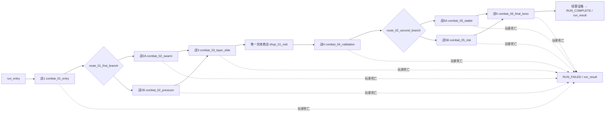

# 《元素地牢》局内构筑与关卡流程实现契约

> 文档性质：当前正式 RunGame 实现合同；任务 29/31 章节保留为历史验收记录
> 状态：Task41 当前合同
> 形成日期：2026-08-05  
> 最高优先级输入：`docs/design/元素地牢_局内构筑与成长机制变更需求.md`  
> 本文边界：只冻结架构、流程、路径所有权与验收，不实现代码、场景、资源或数值

## 0. 结论先行

下一轮正式实现采用以下唯一方向：

```text
新的正式主入口 RunGame
→ 创建一局唯一 RunSessionHost / RunSession
→ 持久保留玩家、HUD、技能配装、被动 Runtime 与局内经济
→ 只替换 RoomContainer 中的真实房间实例
→ 连续完成六战、两次路线、一个实体商店
→ 战 1～5 清场后开启实体宝箱，再由实体门推进
→ Boss 清场后开启零奖励结算宝箱，形成不可变结算
```

局内构筑采用：

```text
3 个主动槽（只装主动）
+ 4 个被动槽（只装被动）
+ 单一梦尘钱包
+ 主动技能独立等级与 70% 升级投入重置返还
```

角色等级、经验、属性点和遗物在正式原型中均为 `DISABLED`。旧代码和资源继续可加载，但不能通过隐藏 UI 冒充停用，也不能继续影响正式奖励、属性或战斗效果。

正式流程绝不使用单一 `TestRoom` 内刷新敌人模拟换房。`scenes/test_room.tscn` 保留为调试场景，`project.godot` 的 `run/main_scene` 在任务 29 改为新的 `scenes/run/run_game.tscn`。

---

## 1. 权威来源与覆盖关系

### 1.1 优先级

1. `docs/design/元素地牢_局内构筑与成长机制变更需求.md`：产品规则最高优先级；
2. 本实现契约：把产品规则冻结成可实施的领域、场景、UI、路径和验收合同；
3. `docs/design/元素地牢_关卡流程竞品探测与适配设计报告.md`：只保留不冲突的关卡结构建议；
4. `docs/current_gameplay_design_handoff.md`、`docs/design/元素地牢_技能遗物与局内成长系统策划案.md`：只描述迁移前事实。

### 1.2 迁移与废止表

| 迁移前口径 | 新正式口径 | 处理方式 | 验收证据 |
| --- | --- | --- | --- |
| 共享 `ACTIVE_1～3 + PASSIVE_1` | `ACTIVE_1～3 + PASSIVE_1～4` | 七槽快照；主动/被动严格分区 | 七槽领域 runner、四被动实际 Runtime |
| ACTIVE 可装被动，`0 主动 + 4 被动` 通过混装表达 | ACTIVE 只装主动，PASSIVE 只装被动 | 旧混装快照执行确定性迁移；不保留混装入口 | 类型拒绝、迁移矩阵、无部分提交 |
| 免费技能/遗物奖励三选一 | 战 1～5 实体宝箱：未拥有 `reward_pool` 技能或 150 梦尘 | 移除正式 `REWARD` 页面；类型化宝箱结果原子进入技能库或钱包 | 宝箱一次性、重放与经济守恒 runner |
| 无货币、技能无等级 | 单梦尘；主动技能独立等级 | 新经济与技能运行态；静态内容提供购买/升级数据 | 购买、升级、返还和伤害/资源效果测试 |
| 击杀/房间经验 → 等级 → 属性点 | 正式模式固定 Lv1 / XP0 / 属性0 | 通过功能模式拒绝经验投影；绝不把旧经验值直接改名成梦尘 | 事件仍去重但 Progression 中性 |
| 遗物奖励与 Runtime 效果启用 | 遗物正式 `DISABLED` | 不生成、不拥有、不注册、不派发效果；资源仍验证可加载 | 保留目录资源但正式快照/路线/UI无遗物 |
| 商店确认属性并提交配装 | 购买、升级、重置、装配均为独立即时事务 | 离店只推进流程；不提交属性或二次提交配装 | 离店前后经济/配装 revision 不重复变化 |
| 每 3 房固定商店，第 6 房后商店结束 | 战 3 后唯一实体商店；Boss 后结算宝箱 | 流程由静态节点图和世界交互门禁驱动 | 六战、两路线、一商店完整一局 |
| `TestRoom` 是运行主场景 | 新 `RunGame` 是正式入口 | `TestRoom` 不删除、不扩成伪关卡 | `project.godot` 主入口与实际换房截图 |

### 1.3 继续有效的旧规则

以下内容不因本轮变化而修改：

- 固定普通攻击位于七槽之外；
- 单一 `CurrentElement`、三类元素策略和接受时锁定快照；
- 水火反应公式、伤害结算顺序、SP 扣除与释放原子性；
- 静态 Resource 与局内运行态分离；
- UI 只能显示快照和请求命令，不能拥有奖励、经济、路线或配装规则；
- 策划验证过的完整房间模板优先，首版不做随机平台拼接；
- 最终 Boss 零击杀/完成/宝箱奖励；玩家开启结算宝箱后进入结果。

---

## 2. 领域模型总览

```text
静态局内配置
├── RunContentCatalog
│   ├── SkillContentDefinition
│   │   ├── SkillDefinition（战斗行为）
│   │   ├── purchase_price
│   │   └── ActiveSkillProgressionDefinition（仅主动）
│   └── RelicDefinition（可加载；正式模式停用）
└── RunFlowDefinition（由正式 RunGame 独立持有）

RunSession（单局唯一权威）
├── RunRulesSnapshot（开局冻结）
├── RunEconomyState（梦尘及收支）
├── SkillInventoryState（拥有、等级、累计升级实付）
├── RuntimeSkillLoadout Port（七槽映射及 loadout revision）
├── ProgressionState（正式中性，旧系统可加载）
├── RelicInventory/Controller（正式不注册）
├── RunDirector / RouteState（节点、阶段、路线、结算）
├── ShopSnapshot（当前商店会话与固定候选）
└── RunResultSnapshot（终局冻结）
```

### 2.1 静态定义与运行态

静态 Resource 只声明内容，不保存本局状态：

- `ActiveSkillLevelDefinition`：等级号、从前一级升级所需梦尘、伤害/治疗/护盾/资源恢复等允许的数值缩放；
- `ActiveSkillProgressionDefinition`：连续等级表、最高等级及验证；
- `SkillContentDefinition`：购买价、主动升级定义或被动无等级标记；
- `RunFlowDefinition`：节点图、入口节点、每个节点的唯一后继；
- `RunNodeDefinition`：节点类型、房间配置、路线分支、商店库存或终局语义；
- `CombatRoomDefinition`：PackedScene、敌人生成、梦尘奖励、Boss/终局标记；
- `RouteBranchDefinition`：门牌文字、目标节点、遭遇、环境、风险和预期资源信息。

运行态只保存稳定 ID、数字、布尔和不可变快照，不保存 Player、敌人、场景或可变 Resource 引用。

### 2.2 功能模式

新增 `RunFeatureMode` 或同义枚举：

| 模式 | 角色成长 | 遗物 |
| --- | --- | --- |
| `DISABLED` | Progression 始终投影为 Lv1/XP0/0点；经验事件不改变正式状态 | 不生成、获取、注册、advance 或派发效果 |
| `OBSERVE_ONLY` | 可记录理论经验总量供开发诊断，但正式 Progression 和玩家属性仍中性 | 可记录本应命中的事件/候选计数，但不拥有、不注册、不产生效果 |
| `ENABLED` | 允许旧等级/属性逻辑运行 | 允许旧遗物逻辑运行；只用于兼容回归/未来实验 |

正式 `RunGame` 必须显式传入：

```text
progression_mode = DISABLED
relic_mode = DISABLED
upgrade_refund_basis_points = 7000
```

模式在 `RunSession` 构造时复制进 `RunRulesSnapshot`，整局不可变。UI 不提供中途切换。直接隐藏 HUD 不算停用；RunSession 必须在入口拒绝相应状态变化。

### 2.3 梦尘状态

`RunEconomyState` 至少保存：

```text
balance
total_earned
total_spent_on_purchases
total_spent_on_upgrades
total_refunded
```

所有字段为非负整数，满足：

```text
balance = total_earned + total_refunded
          - total_spent_on_purchases
          - total_spent_on_upgrades
```

击杀梦尘与房间完成梦尘必须使用新字段，不能读取 `experience_reward` 或 `completion_experience` 作为替代。终局 Boss 的击杀和房间完成梦尘均为 0。

### 2.4 技能运行态

每个已拥有技能生成一条 `SkillProgressSnapshot`：

```text
skill_id
activation_kind
level                  # 主动从 1 开始；被动固定 1
cumulative_upgrade_spend
acquisition_kind       # INITIAL / PURCHASED / LEGACY_MIGRATED / SCRIPTED
```

约束：

- 主动购买后为 Lv1；初始元素弹也为 Lv1；
- 被动首版固定 Lv1，累计升级投入恒为 0；
- 普通换槽、卸下、跨房、失败重试 UI、重开商店都不改变等级；
- 购买价不进入 `cumulative_upgrade_spend`；
- 每次升级按实际扣除价格增加累计实付；
- 重置返还 `floor(cumulative_upgrade_spend × 7000 / 10000)`，随后等级回到 1、累计实付清零；
- 同一笔升级不能通过重放、重置重放或旧快照重复返还。

### 2.5 七槽配装

七槽固定顺序：

```text
ACTIVE_1, ACTIVE_2, ACTIVE_3,
PASSIVE_1, PASSIVE_2, PASSIVE_3, PASSIVE_4
```

Runtime 规则：

- ACTIVE 槽非空时必须引用已拥有主动技能；
- PASSIVE 槽非空时必须引用已拥有被动技能；
- 同一技能 ID 在七槽中最多出现一次；
- 所有槽可为空；是否允许正式新局 0 主动由流程配置决定，底层不伪造混装；
- 一次合法整体替换只增加一次 `loadout_revision`；
- 四个被动分别只注册一次；跨房调用 `rebuild` 不产生第五个实例或重复订阅。

---

## 3. 主动等级的战斗投影合同

### 3.1 允许的等级效果

`ActiveSkillLevelEffectSnapshot` 至少包含：

```text
skill_id
level
damage_scale
healing_scale
shield_scale
resource_gain_scale
```

未配置或旧内容返回中性值 `1.0`。首批技能按其实际能力只读取相关字段：

- 元素弹、元素之怒、元素激光：读取 `damage_scale`；
- 回收：读取 `resource_gain_scale`；
- 未来治疗/护盾主动才读取对应字段。

通用等级系统禁止修改 SP 成本、元素附着量、全局反应倍率、作用半径、目标选择、冷却、槽位或技能行为。静态 `SkillDefinition` 不得被运行时改写。

### 3.2 接受时冻结

Combat 侧通过窄 `ActiveSkillLevelEffectPort` 查询技能的当前等级效果。查询发生在释放验证/接受边界，结果复制进 `CastSnapshot` 或等价的不可变执行上下文。

```text
请求释放
→ 校验技能、SP、控制状态、元素与执行定义
→ 查询当前等级效果
→ 接受时一起锁定 skill_id / level / effect scales
→ 后续投射物、Beam tick、延迟攻击、爆发与回收只读锁定值
```

升级发生在攻击生成后不得回写旧投射物或正在运行的旧 Beam。等级端口缺失时使用中性值，保证 `TestRoom` 和历史夹具可加载；正式 `RunGame` 必须由 `RunSkillLevelEffectAdapter` 接到当前 RunSession。

---

## 4. 命令、拒绝、revision 与通知

### 4.1 通用命令信封

所有会改变局内状态的 UI/流程请求至少携带：

```text
command_id              # 本局唯一
expected_run_revision
shop_session_id         # 仅商店事务
目标 ID / 候选 ID / 槽位快照
```

`command_id` 第一次接受时保存“命令指纹 + 已提交结果 revision”。完全相同的重放返回幂等成功结果，不增加 revision、不重复通知；相同 ID 携带不同参数拒绝为 `COMMAND_ID_REUSED`。

### 4.2 正式商店命令

| 命令 | 核心验证 | 成功变化 |
| --- | --- | --- |
| `purchase_skill` | SHOP、会话/offer/revision、未拥有、价格、余额、内容合法 | 扣购买价，加入 Lv1，run +1 |
| `upgrade_active_skill` | SHOP、已拥有主动、未满级、数据完整、余额 | 扣本级价格，等级+1、累计实付增加，run +1 |
| `reset_active_skill_upgrades` | SHOP、已拥有主动、等级>1、累计实付>0 | 返还向下取整 70%，回 Lv1、累计清零，run +1 |
| `apply_shop_loadout_immediately` | SHOP、会话/revision、拥有、七槽/类型/重复合法 | loadout +1、run +1；相同映射幂等 |
| `leave_shop` | SHOP、会话/revision、没有进行中的单笔确认 | 只推进流程，run +1；不提交属性/配装 |

购买、升级、重置分别需要一次明确确认；普通槽位点击/拖放仍按任务 25 语义即时提交。

### 4.3 最小拒绝原因

在现有 `RunCommandResult` 基础上至少能稳定区分：

```text
FEATURE_DISABLED
INVALID_STATE
STALE_RUN_REVISION
STALE_SHOP_SESSION
COMMAND_ID_REUSED
UNKNOWN_OFFER
ALREADY_OWNED
INSUFFICIENT_DREAM_DUST
PASSIVE_HAS_NO_LEVELS
ACTIVE_LEVEL_DATA_MISSING
MAX_LEVEL_REACHED
NO_UPGRADE_INVESTMENT
LOADOUT_TYPE_MISMATCH
DUPLICATE_EQUIPPED_SKILL
DUPLICATE_ROOM
STALE_ROUTE_OPTION
SCENE_TRANSITION_FAILED
RUN_ALREADY_FINISHED
CONFIGURATION_ERROR
```

UI 只能翻译这些结构化原因，不能自行推导余额、类型、返还或路线合法性。

### 4.4 revision 规则

- `run_revision`：RunSession 聚合 revision；每个首次接受的外部命令或去重后的战斗奖励提交恰好 +1；
- `loadout_revision`：只有七槽映射实际改变时 +1；
- 路线、商店和结算不另建可与 RunSession 竞争的公共 revision；它们的快照随 `run_revision` 校验；
- 打开新商店生成新的 `shop_session_id` 和固定 offer；同一商店关闭再打开不能重随；
- 拒绝、完全相同命令重放、相同配装映射不增加任何 revision。

### 4.5 成功通知次序

购买、升级、重置和梦尘奖励：

```text
完成全部纯验证
→ 原子修改子状态
→ 记录 command/event 去重身份
→ run_revision + 1
→ 构造唯一 RunSnapshot
→ emit RunSession.snapshot_changed(snapshot, cause)
→ 返回同一个 snapshot
```

配装事务：

```text
完成拥有/类型/余额无关的全部验证
→ RuntimeSkillLoadout 原子提交并 loadout_revision + 1
→ loadout_replaced（只供持久化/Runtime 适配器）
→ ShopSnapshot 重基线
→ run_revision + 1
→ RunSession.snapshot_changed（UI 唯一聚合通知）
```

UI 不得把较早的 `loadout_replaced` 当作完整局内快照；只在 RunSession 聚合通知后刷新完整商店。

---

## 5. 快照与迁移默认值

### 5.1 RunSnapshot 最小字段

```text
rules
progression
economy
skill_inventory            # 含 SkillProgressSnapshot
relic_inventory
runtime_loadout             # 七槽
route                       # 当前节点/阶段/候选/完成节点
shop                        # 可为空
result                      # 终局前为空
unlocked_element_ids
run_revision
```

所有数组和子快照对调用者不可变；UI 不持有 State 对象。

### 5.2 旧四槽迁移到七槽

迁移必须确定、无随机、无静默丢失：

1. 创建七个空槽；
2. 若旧 `PASSIVE_1` 是合法被动，优先放入新 `PASSIVE_1`；
3. 按旧 `ACTIVE_1 → ACTIVE_2 → ACTIVE_3` 顺序处理：主动保留原主动槽，被动依次填入下一个空被动槽；
4. 重复 ID 只保留第一次；
5. 类型非法、未知或超过槽位容量的技能不装备，但若旧拥有库确认拥有，则继续留在拥有库；
6. 迁移输出始终是完整七槽、revision 保持旧值；第一次玩家主动换装后才增加 revision；
7. 成功后只保存七槽格式，不再双写四槽。

### 5.3 旧成长/遗物与新经济

- 旧 owned skill ID 迁移为 Lv1、累计升级实付 0；
- 旧经验、等级、属性点不转换成梦尘；正式 `DISABLED` 快照投影为 Lv1/XP0/0点；
- 旧遗物 ID 不转换成被动或梦尘；正式 `DISABLED` 不注册效果；
- 梦尘新局余额从流程配置规定的起始值开始，默认 0；
- 不存在金币迁移；
- 当前没有正式跨版本存档，本轮迁移只为旧快照、测试夹具和资源加载提供确定语义。

---

## 6. 两层六战斗节点正式流程

### 6.1 唯一节点表

一局实际完成恰好六个战斗节点；路线分支只改变第 2、5 战的真实房间配置，不增加本局战斗计数。

| 顺序 | 权威节点/候选 ID | 节点类型 | 房间职责 | 完成后的唯一去向 |
| --- | --- | --- | --- | --- |
| 入口 | `run_entry` | ENTRY | 开始新局/返回入口 | `combat_01_entry` |
| 战 1 | `combat_01_entry` | COMBAT | 入口战；清场→宝箱→门 | `route_01_first_branch` |
| 路线 1A | `route_01_swarm` → `combat_02_swarm` | ROUTE→COMBAT | 群怪、平地/双端压力、普通风险 | `combat_03_layer_elite` |
| 路线 1B | `route_01_pressure` → `combat_02_pressure` | ROUTE→COMBAT | 远程压制、双层平台、较高梦尘 | `combat_03_layer_elite` |
| 战 3 | `combat_03_layer_elite` | COMBAT | 第一层层主精英；清场→宝箱→门 | `shop_01_mid` |
| 唯一整备 | `shop_01_mid` | SHOP | 实体安全房；购买/升级/重置/装配，出口门按 F | `combat_04_validation` |
| 战 4 | `combat_04_validation` | COMBAT | 构筑验证战；强度回落后组合测试 | `route_02_second_branch` |
| 路线 2A | `route_02_stable` → `combat_05_stable` | ROUTE→COMBAT | 稳妥收束、标准梦尘 | `combat_06_final_boss` |
| 路线 2B | `route_02_risk` → `combat_05_risk` | ROUTE→COMBAT | 更多/更强敌人、狭长环境、额外梦尘 | `combat_06_final_boss` |
| 战 6 | `combat_06_final_boss` | BOSS | 单 Boss；清场后零奖励结算宝箱 | `RUN_COMPLETE` |
| 结算 | `run_result` | RESULT | 通关/失败、进度、梦尘收支、最终构筑 | 新一局或 `run_entry` |

“战 2”和“战 5”各自只会进入一个分支房；无论选择哪条，一局的 `completed_combat_rooms` 最终必须等于 6。

### 6.2 状态转换图



### 6.3 RunPhase

正式状态至少包含：

```text
ENTRY
ROOM_LOADING
COMBAT
ROOM_RESOLUTION
ROUTE_CHOICE
SHOP
RUN_COMPLETE
RUN_FAILED
```

旧 `REWARD` 页面不再出现在正式路径。战 1～5 的实体宝箱仍处于 `COMBAT`，以类型化命令原子发放未拥有技能或 150 梦尘；宝箱和门不是新 `RunPhase`。

合法转换：

```text
ENTRY → ROOM_LOADING
ROOM_LOADING → COMBAT | RUN_FAILED
COMBAT → ROOM_RESOLUTION | RUN_FAILED
ROOM_RESOLUTION → ROOM_LOADING | ROUTE_CHOICE | SHOP | RUN_COMPLETE
ROUTE_CHOICE → ROOM_LOADING
SHOP → ROOM_LOADING | ROUTE_CHOICE
RUN_COMPLETE / RUN_FAILED → ENTRY（返回）或创建全新 RunSession（新一局）
```

Boss 两波规则例外为单体；清场不自动完成，结算宝箱交互才提交房间并形成 `RUN_COMPLETE`。

### 6.4 路线门牌字段

每个 `RouteOption` 必须携带并持久化：

```text
option_id
target_node_id
title
encounter_label
environment_label
risk_label / risk_tier
expected_dream_dust_label
```

候选在进入 `ROUTE_CHOICE` 时生成并固定；重新打开界面不重随。选择命令用 `option_id + expected_run_revision`，成功后保存 `selected_option_id` 和真实 `target_node_id`。场景加载必须读取 target，不能根据按钮索引或文案猜测房间。

### 6.5 唯一实体商店节点

战 3 后的 `shop_01_mid` 是一局唯一正式商店，提供既有完整权威事务：

- 购买当前固定候选中的主动/被动；
- 升级任意已拥有主动；
- 重置任意有升级投入的主动；
- 分区装配 3 主动 + 4 被动；
- 通过世界中的出口传送门按 F 离开商店。

商店 UI 的离店按钮禁用，只提示前往出口门；出口门只调用既有 `leave_formal_shop` 一次。离店不提交属性、不二次提交配装，也不自动恢复全部生命或 SP。

---

## 7. 正式场景与生命周期

### 7.1 不新增大型 Autoload

任务 29 不新增项目级 RunSession Autoload。新的 `scenes/run/run_game.tscn` 根节点挂载 `RunFlowCoordinator`，该场景本身在整局中常驻，因此已经能提供清晰生命周期和测试替代方案。

唯一现有 MCP helper Autoload 不属于玩法权威。本局状态禁止放入静态变量、UI 草稿或永久全局单例。

### 7.2 RunGame 常驻节点

```text
RunGame / RunFlowCoordinator（整局常驻）
├── RunSessionHost（每局创建一次或明确重建一次）
├── Player（整局常驻；换房只重定位）
├── CombatHUD / RunOverlay（整局常驻）
├── CombatFeedback（整局常驻）
├── SkillVfxCoordinator（整局常驻并重绑敌人）
├── Camera2D（整局常驻）
├── RoomStaging（候选房间离线验证）
└── RoomContainer（任一时刻恰好一个活动 RunRoomInstance）
```

玩家的生命、SP、CurrentElement、RuntimeLoadout、技能等级和被动实例跨房保留。换房时只执行明确的房间生命周期钩子、清理旧 Delivery/敌人引用、更新目标集合与重定位。

### 7.3 真实换房事务

`RunFlowCoordinator` 的换房顺序冻结为：

1. 从权威快照读取唯一 `pending_node_id`；
2. 在 `RoomStaging` 实例化对应 PackedScene，暂停处理并验证 `RunRoomInstance`、玩家出生点、敌人出生点和配置；
3. 若实例化/验证失败，不调用成功进入命令；向 RunSession 提交一次 `SCENE_TRANSITION_FAILED` 终局失败，禁止刷新当前房敌人冒充成功；
4. 候选完整后，以唯一 `transition_id + expected_run_revision` 请求 Host/RunSession 接受该战斗节点；
5. 成功后清理旧房间与残留 Delivery，把候选移入 `RoomContainer` 并激活；
6. 将常驻 Player 移至出生点，Host 和 VFX 重新绑定本房敌人，CurrentElement 事件房间 ID 同步；
7. 发布一次 `room_activated` 集成通知，战斗开始。

同一 `transition_id` 重放不得生成第二个房间、第二组敌人或重复 begin。任一时刻活动 `RunRoomInstance` 数量必须为 1。

### 7.4 房间模板

任务 29 创建四张低精度、完整可玩的模板，不做随机平台拼接：

- `room_arena_flat.tscn`：平地决斗/精英；
- `room_arena_platforms.tscn`：双层平台/远程压制；
- `room_arena_corridor.tscn`：狭长收束战；
- `room_arena_boss.tscn`：占位 Boss 专用场。

普通战斗配置引用上述模板：首波 3～5 名，预实例化休眠援军 2～3 名；首波全灭立即或房间激活 12 秒时只激活一次，必须两波全灭才显示宝箱。Boss 复用现有敌人，视觉约 1.7 倍并有紫色轮廓，仅增加一种走既有 `ProjectileDelivery` 的低空慢速横向弹体。

### 7.5 职责边界

| 对象 | 唯一职责 | 明确禁止 |
| --- | --- | --- |
| `RunSession` | 经济、拥有、等级、七槽协调、节点阶段、类型化宝箱奖励、结果的领域权威 | 读取场景 clear/距离/活动实例、Node、UI、直接改 Player |
| `RunDirector/RouteState` | 按静态图验证下一节点、路线和完成顺序 | 计算梦尘价格、战斗伤害或加载场景 |
| `RunSessionHost` | 持有唯一 RunSession/RuntimeLoadout，投影已提交战斗事件，重绑房间敌人 | 决定路线文案、实例化房间、由 UI 替换 Session |
| `RunFlowCoordinator` | 正式入口、新局/回入口、真实房间实例生命周期、调用权威命令 | 自行加梦尘、发技能、改等级、绕过阶段 |
| `RunRoomInstance` | 几何、出生点、首波/休眠援军、clear 与宝箱/门场景门禁 | 保存跨房状态、直接发奖励、决定下一房 |
| Combat/Player | 执行技能、SP、元素、伤害和锁定等级效果 | 查询商店价格、改变梦尘或路线 |
| UI | 显示快照、采集确认、发送命令、恢复焦点 | 本地扣款、升级、退款、生成路线或宣布通关 |

---

## 8. 失败、重复与结算保护

### 8.1 房间与路线

- 房间完成事件身份至少包含 `run_id + node_id + room_instance_id`；同一实例只接受一次；
- 当前节点未处于 COMBAT、room ID 不匹配或已完成时拒绝；
- 旧路线 option、旧 run revision、未知 target 或已选路线重放不改变状态；
- 选路成功后候选立即从公开快照清除，并保存唯一 pending target；
- 房间配置失败不得回落到当前 TestRoom 或偷偷刷新敌人。

### 8.2 玩家死亡

玩家在任一战斗房死亡时只接受一次失败命令：

- 清理活动技能/被动运行实例的战斗期状态；
- 保留终局构筑和梦尘收支快照供结算；
- 进入 `RUN_FAILED`；
- 不发本房完成梦尘、不生成商店或路线；
- 结算 UI 可新开一局或返回入口。

### 8.3 最终 Boss 与结果

Boss 结算宝箱交互后：

- Boss 击杀梦尘 = 0；房间完成梦尘 = 0；
- 结算宝箱本身不生成技能、梦尘、遗物、路线或商店；
- 同一房间完成事务内冻结 `RunResultSnapshot` 并进入 `RUN_COMPLETE`；
- 重复 Boss 击杀、房间完成或结算打开不增加 revision、不改变收支；
- 结果至少包含 outcome、完成战斗数/总数、完成节点 ID、总赚取/购买/升级/返还/余额、最终技能等级、最终七槽和失败原因。

新一局必须创建新的 run ID、RunSession、去重集合、经济和结果；不能复用上局 UI 草稿或静态变量。

---

## 9. 产品需求 14 场景覆盖矩阵

| # | 产品场景 | 合同落点 | 主验收任务 |
| ---: | --- | --- | --- |
| 1 | 单梦尘，无金币/经验增长/属性/遗物候选 | 2.2、2.3、6.5 | 27、29、30 |
| 2 | 购买主动 Lv1、只扣一次、余额不足不变 | 2.4、4.2 | 27 |
| 3 | 购买被动可装四被动槽且不能升级 | 2.4、2.5 | 27、28 |
| 4 | 主动/被动严格分区，失败无部分状态 | 2.5、5.2 | 28 |
| 5 | 四被动各注册一次，跨房不重叠 | 2.5、7.2 | 28、29 |
| 6 | SP 事务不改成全局冷却/强制轮换 | 1.3、3 | 27、31 |
| 7 | 主动升级扣款、等级和累计投入原子 | 2.4、4.2 | 27 |
| 8 | 卸下/换槽/跨房保留等级且不退款 | 2.4、7.2 | 27、28、29 |
| 9 | 重置只返还升级实付 70%，回 Lv1，防重放 | 2.4、4 | 27 |
| 10 | 成长关闭但事件仍可供其他系统消费 | 2.2、5.3 | 27、29 |
| 11 | 成长关闭后被动/临时效果仍可工作 | 2.2、7.2 | 28、29 |
| 12 | 遗物资源保留但正式路线/UI/Runtime无遗物 | 2.2、6 | 27、29、30 |
| 13 | 商店 UI 与权威快照一致，离店无属性草稿 | 4、6.5 | 27、30 |
| 14 | Boss 零奖励结算宝箱进入结果 | 6、8.3 | 41 |

横向门禁另覆盖 1920×1080、2560×1440 实际画面、180 帧主场景 smoke、完整一局和真实换房。

---

## 10. 任务 27～31 可直接立项草案

## 10.1 任务 27：梦尘、主动等级与功能模式权威

**依赖**：任务 26 `ACCEPTED`。  
**唯一负责人职责**：Growth/Economy Domain Agent；负责经济、技能进度、模式、等级效果窄端口和原子事务，不负责七槽迁移、正式关卡或最终 UI。  
**目标**：在保持旧资源可加载的前提下，建立单梦尘、购买、主动升级、70% 重置、成长/遗物模式和接受时等级效果冻结。

### 精确 allowlist

```text
growth/contracts/run_feature_mode.gd                         # 新增
growth/contracts/run_rules_snapshot.gd                       # 新增
growth/contracts/dream_dust_snapshot.gd                      # 新增
growth/contracts/active_skill_level_effect_snapshot.gd       # 新增
growth/contracts/skill_progress_snapshot.gd                  # 新增
growth/contracts/shop_offer_snapshot.gd                      # 新增
growth/contracts/shop_snapshot.gd                            # 新增
growth/contracts/run_command_result.gd
growth/contracts/run_snapshot.gd
growth/contracts/skill_inventory_snapshot.gd
growth/contracts/shop_draft_open_result.gd
growth/contracts/shop_commit_summary.gd
growth/definitions/active_skill_level_definition.gd          # 新增
growth/definitions/active_skill_progression_definition.gd    # 新增
growth/state/run_economy_state.gd                            # 新增
growth/state/skill_inventory_state.gd
growth/shop/shop_draft.gd
growth/run_session.gd
growth/events/enemy_killed_event.gd
growth/events/room_completed_event.gd
combat/content/skill_content_definition.gd
combat/content/run_content_catalog.gd
combat/contracts/cast_snapshot.gd
combat/ports/active_skill_level_effect_port.gd                # 新增
combat/components/skill_executor.gd
combat/components/skill_controller.gd
combat/execution/skill_execution_context.gd
combat/execution/all_energy_burst_execution.gd
combat/execution/channel_execution.gd
combat/execution/element_reclaim_execution.gd
scripts/player.gd
scripts/run_skill_level_effect_adapter.gd                    # 新增
resources/content/run_content_catalog.tres                   # 填入可运行的首版购买/升级数据
resources/content/skills/element_bolt_content.tres
resources/content/skills/elemental_fury_content.tres
resources/content/skills/elemental_laser_content.tres
resources/content/skills/element_reclaim_content.tres
resources/content/skills/burning_content.tres
resources/content/skills/unending_content.tres
growth/tests/run_growth_tests.gd                              # 仅迁移构造/旧模式断言
growth/tests/run_growth_contract_edge_tests.gd               # 同上
growth/tests/run_growth_06_contract_tests.gd                  # 同上
growth/tests/run_growth_session_isolation_test.gd            # 同上
growth/tests/run_reward_authority_tests.gd                    # 同上
growth/tests/run_task25_immediate_shop_equip_tests.gd         # 同上
growth/tests/run_task27_run_economy_progression_tests.gd      # 新增主 runner
combat/tests/run_task27_skill_level_effect_tests.gd           # 新增主 runner
combat/tests/capture_task27_skill_level_visual.gd             # 新增实际 Viewport
docs/agent_tasks/pending/27_run_economy_skill_progression_authority.md
docs/agent_tasks/evidence/task27/**
```

### 禁止范围

- 不改 `SkillSlotIds`、RuntimeSkillLoadout 七槽形状、HUD、路线状态机、主场景或房间；
- 不删除经验/属性/遗物类；不把 XP 数值复制成梦尘；
- 不改变 SP、冷却、元素附着、反应、范围或行为；
- 不以 UI 本地余额证明经济完成。

### 自动化与实际画面

- 主 runner 覆盖购买、升级、满级、余额不足、返还向下取整、购买价不返、重放/陈旧 revision、DISABLED/OBSERVE_ONLY/ENABLED、被动无等级、终局零奖励字段；
- Combat runner 覆盖元素弹/之怒/激光伤害缩放、回收资源缩放、接受后升级不污染旧执行、端口缺失中性；
- 冷副本 editor scan、全接受基线 runners 和 TestRoom 180 帧 smoke；
- 1920×1080 实际 Viewport：真实 TestRoom 中权威 Lv2 主动产生已断言的等级效果，截图只作集成证据，自动化为数值权威。

### 移交条件

任务 27 `REVIEW` 后冻结上述路径；任务 28 从其最终 RunSnapshot、内容 Schema 和 RunSession revision 合同继续，不并发改写。

## 10.2 任务 28：七槽与四被动 Runtime

**依赖**：任务 27 `ACCEPTED`。  
**唯一负责人职责**：Combat Loadout/Passive Runtime Agent；负责七槽形状、严格类型、旧四槽迁移、四被动注册和共享快照持久化，不负责正式关卡或最终 UI。  
**目标**：把运行配装完整迁移为 3 主动 + 4 被动，并在 TestRoom/领域测试中证明跨 floor rebuild 不重复。

### 精确 allowlist

```text
combat/loadouts/skill_slot_ids.gd
combat/loadouts/runtime_skill_loadout.gd
combat/loadouts/legacy_element_loadout_migrator.gd
combat/loadouts/shared_four_slot_to_seven_slot_migrator.gd     # 新增
combat/loadouts/seven_slot_migration_result.gd                # 新增
combat/definitions/skill_loadout.gd
combat/content/skill_content_definition.gd                    # 串行覆盖任务27的槽位校验部分
combat/content/run_content_catalog.gd                         # 串行覆盖默认七槽投影
combat/passives/passive_skill_controller.gd                   # 只限四被动生命周期/幂等需要
growth/run_session.gd                                         # 只限七槽即时装配聚合验证
scripts/shared_loadout_persistence_adapter.gd
resources/shared_skill_loadout.tres
combat/tests/run_agent_d_growth_integration_tests.gd          # 只改已废止3+1契约
combat/tests/run_hud_loadout_feedback_tests.gd                # 只改权威拒绝语义，不做最终布局
combat/tests/run_skill_content_catalog_tests.gd
combat/tests/run_skill_tests.gd
combat/tests/run_skill_vfx_runtime_tests.gd                   # 只改夹具快照形状
combat/tests/run_compact_hud_reward_tests.gd                  # 只改夹具快照形状
growth/tests/run_growth_06_contract_tests.gd                  # 串行迁移七槽断言
growth/tests/run_task25_immediate_shop_equip_tests.gd         # 串行迁移即时装配断言
combat/tests/run_task28_seven_slot_passive_tests.gd           # 新增主 runner
combat/tests/capture_task28_four_passives_visual.gd           # 新增实际 Viewport
docs/agent_tasks/pending/28_seven_slot_passive_runtime.md
docs/agent_tasks/evidence/task28/**
```

### 禁止范围

- 不改 `project.godot`、正式主入口、房间、流程节点、梦尘公式或技能等级数值；
- 不修改任务 12/20/24 历史 capture 和 evidence；
- 不在本任务重做最终 HUD；临时 HUD 可继续只展示旧兼容信息，任务 30 必须完成正式 3+4 分区；
- 不保留 ACTIVE 可装被动的正式兼容分支。

### 自动化与实际画面

- 主 runner 覆盖七槽完整性、双向类型拒绝、重复 ID、空槽、旧 `PASSIVE_1` 优先迁移、ACTIVE 被动顺序迁移、溢出留拥有库、revision 和幂等；
- 四个被动同时注册、卸下、换槽、死亡/重生、floor change、run reload 和 run end 各恰好一次；
- 所有受新合同覆盖的旧 runner 更新后通过，历史证据不篡改；
- 1920×1080 实际 TestRoom Viewport：捕获脚本在保存前断言七槽和四个被动 Runtime，画面可加只读诊断标签，但不冒充任务 30 最终 UI。

### 移交条件

任务 28 验收后，七槽快照和迁移格式冻结。任务 29 只消费该 Runtime，不再发明第二套配装持久化。

## 10.3 历史验收记录：任务 29 正式主入口与六战斗节点闭环

> 以下三商店、杀敌后自动推进和 Boss 直提交流程只记录 Task29 当时验收范围；当前实现已由 Task41 的六战/两路线/一实体商店/宝箱与门合同取代。

**依赖**：任务 28 `ACCEPTED`。  
**唯一负责人职责**：Run Flow/Scene Integration Agent；负责新正式入口、持久 Host/Session、真实房间实例切换、两次路线、三次商店、六战斗节点、占位 Boss 和结算。  
**硬门禁**：不能在单一 TestRoom 刷新敌人；不能只完成状态机 runner；F6/运行项目必须从新入口连续抵达结算。

### 精确 allowlist

```text
project.godot                                               # 仅改 run/main_scene
growth/contracts/run_phase.gd
growth/contracts/route_option.gd
growth/contracts/route_snapshot.gd
growth/contracts/run_snapshot.gd                            # 串行加入flow/result
growth/contracts/run_command_result.gd                      # 串行加入flow拒绝
growth/contracts/run_node_snapshot.gd                       # 新增
growth/contracts/run_result_snapshot.gd                     # 新增
growth/flow/run_node_kind.gd                                # 新增
growth/flow/run_flow_definition.gd                          # 新增
growth/flow/run_node_definition.gd                          # 新增
growth/flow/route_branch_definition.gd                      # 新增
growth/flow/combat_room_definition.gd                       # 新增
growth/flow/enemy_spawn_definition.gd                       # 新增
growth/state/route_state.gd
growth/run_director.gd
growth/run_session.gd                                       # 串行最终加入节点推进/结果
growth/shop/shop_draft.gd                                   # 只限离店无属性/流程会话
scripts/run_session_host.gd                                 # 改为一次建Session、逐房重绑
scripts/enemy.gd                                            # 新梦尘/房间实例身份配置
scripts/run/run_flow_coordinator.gd                         # 新增
scripts/run/run_room_instance.gd                            # 新增
scripts/run/run_flow_smoke_panel.gd                         # 新增，任务29最小可玩UI
scripts/vfx/skill_vfx_coordinator.gd                        # 只限逐房敌人重绑若现有接口不足
scenes/run/run_game.tscn                                    # 新增正式主入口
scenes/run/run_flow_smoke_panel.tscn                        # 新增最小可玩UI
scenes/run/rooms/room_arena_flat.tscn                       # 新增
scenes/run/rooms/room_arena_platforms.tscn                   # 新增
scenes/run/rooms/room_arena_corridor.tscn                    # 新增
scenes/run/rooms/room_arena_boss.tscn                        # 新增
resources/run/flows/prototype_two_layer_six_combat.tres      # 新增
resources/run/rooms/combat_01_entry.tres                     # 新增
resources/run/rooms/combat_02_swarm.tres                     # 新增
resources/run/rooms/combat_02_pressure.tres                  # 新增
resources/run/rooms/combat_03_layer_elite.tres               # 新增
resources/run/rooms/combat_04_validation.tres                # 新增
resources/run/rooms/combat_05_stable.tres                    # 新增
resources/run/rooms/combat_05_risk.tres                      # 新增
resources/run/rooms/combat_06_final_boss.tres                # 新增
growth/tests/run_task29_run_flow_contract_tests.gd           # 新增领域 runner
combat/tests/run_task29_real_room_flow_tests.gd              # 新增真实场景 runner
combat/tests/capture_task29_full_run_visual.gd               # 新增实际 Viewport
docs/agent_tasks/pending/29_playable_six_room_run_flow.md
docs/agent_tasks/evidence/task29/**
```

### 禁止范围

- 不修改 `scenes/test_room.tscn` 或 `scripts/test_room.gd` 来伪造正式流程；
- 不新增玩法 RunSession Autoload、静态局内钱包或 UI 草稿权威；
- 不做随机平台拼接、新敌人美术、精细 Boss、多阶段 Boss 或新元素；
- 不改任务 27 经济公式、任务 28 七槽规则或任务 30 最终视觉；
- 不在 Boss 后进入商店或生成梦尘/内容奖励。

### 自动化与实际画面

- 领域 runner 覆盖唯一节点图、每局恰好六战、两条分支真实 target、三个商店位置、Boss 直结算、死亡、重复完成、陈旧路线、重复结算、scene failure；
- 真实场景 runner 必须从 `scenes/run/run_game.tscn` 开始，观察至少两次不同 PackedScene/实例 ID 的换房，完成选路、商店消费、六战和结算；禁止直接调用终局方法跳过房间；
- 新正式主场景 180 帧 smoke，TestRoom 单独 smoke 仍可加载；
- 1920×1080 实际 Viewport 至少四张：新入口/战1、路线选择、不同模板的后续房、占位 Boss 后结算；截图前夹具断言 `completed_combat_rooms == 6`、最终 phase 和场景实例更换记录。

### 移交条件

任务 29 验收时，即使 UI 仍是最小 smoke panel，也必须人工可从新入口打完整一局。任务 30 只替换展示和交互层，不修补关卡权威或场景无法推进。

## 10.4 任务 30：正式 HUD、商店、路线与结算 UI

**依赖**：任务 29 `ACCEPTED`。  
**唯一负责人职责**：UI/HUD Agent；负责 3 主动 + 4 被动分区、梦尘商店、透明路线门牌和结算呈现，只通过任务 29 暴露的命令/快照交互。  
**目标**：移除正式主入口对 smoke panel 的依赖；保持主流程权威零变化。

### 精确 allowlist

```text
scripts/combat_hud.gd
scripts/ui/combat_ui_tokens.gd
scripts/ui/run_overlay_interface.gd
scenes/combat_hud.tscn
scenes/run/run_game.tscn                                   # 串行替换smoke panel接线
scripts/run/run_flow_coordinator.gd                        # 仅UI-facing信号/只读接口接线
combat/tests/run_agent_d_integration_tests.gd              # 新合同UI夹具迁移
combat/tests/run_hud_loadout_feedback_tests.gd             # 3+4分区正式断言
combat/tests/run_compact_hud_reward_tests.gd               # 移除免费奖励旧断言
combat/tests/run_task24_compact_hud_reward_tests.gd        # 新需求覆盖后的正式HUD回归
combat/tests/run_task30_run_ui_tests.gd                    # 新增主 runner
combat/tests/capture_task30_run_ui_visuals.gd              # 新增实际 Viewport
docs/agent_tasks/pending/30_run_hud_shop_route_results_ui.md
docs/agent_tasks/evidence/task30/**
```

### 禁止范围

- 不修改梦尘余额、价格、等级、返还、七槽合法性、路线目标、房间完成或结算结果；
- 不修改任务 12/20/24 历史 PNG/evidence，不把任务 20 runner 恢复为门禁；
- 不以本地预览扣款或本地路由掩盖权威拒绝；
- 不改变战斗碰撞、VFX、技能时序或主场景流程资源。

### UI 信息合同

- 战斗 HUD：生命、SP、CurrentElement、3 个主动操作槽；4 个被动在独立低权重区域；
- 主动显示键帽/SP/可释放状态；被动无键帽、SP 或虚假冷却；
- 商店显示余额、固定候选、购买价、主动等级、下一级效果/价格、累计投入、70%预计返还、七槽分区和“离开商店”；
- 路线卡同时显示资源、遭遇、环境、风险；聚焦不等于选择，显式确认后才发送命令；
- 结算显示 outcome、6房进度、梦尘收支、最终技能等级和七槽，可新一局或返回入口；
- 完全隐藏等级/经验/属性点和遗物区域。

### 自动化与实际画面

- 主 runner 覆盖权威成功/失败、余额不足、满级、重置确认、四被动分区、路线焦点不选择、陈旧命令恢复、Boss 后结果和键盘/焦点导航；
- 正式主场景 180 帧 smoke 和完整一局 UI 自动化；
- 实际 Viewport 至少覆盖 1920×1080 与 2560×1440：战斗 HUD、早期商店、路线、四被动配装、通关结算；另做 1366×768 边界检查；
- 视觉证据必须来自真实 `RunGame`，不能只拍静态 mockup。

### 移交条件

任务 30 验收后，任务 31 不再修改系统/UI 代码；若端到端发现结构问题，退回对应任务负责人，而不是由内容 Agent 越权修补。

## 10.5 历史验收记录：任务 31 基础内容、数值与整轮端到端回归

> 以下节点接线和端到端路径是 Task31 当时的验收记录；基础经济与七槽断言继续受保护，三商店与自动推进路径已由 Task41 替换。

**依赖**：任务 30 `ACCEPTED`。  
**唯一负责人职责**：Content/Balance & E2E Validation Agent；只调整首批静态内容、房间配置和新增验证夹具，不修改权威代码。  
**目标**：让梦尘产销、首批主动等级、六战敌群与占位 Boss 达到可内部测试的基础节奏，并完成整轮最终验收。

### 精确 allowlist

```text
resources/content/run_content_catalog.tres                    # 串行最终内容值
resources/content/skills/element_bolt_content.tres
resources/content/skills/elemental_fury_content.tres
resources/content/skills/elemental_laser_content.tres
resources/content/skills/element_reclaim_content.tres
resources/content/skills/burning_content.tres
resources/content/skills/unending_content.tres
resources/run/flows/prototype_two_layer_six_combat.tres       # 串行最终节点数值
resources/run/rooms/combat_01_entry.tres
resources/run/rooms/combat_02_swarm.tres
resources/run/rooms/combat_02_pressure.tres
resources/run/rooms/combat_03_layer_elite.tres
resources/run/rooms/combat_04_validation.tres
resources/run/rooms/combat_05_stable.tres
resources/run/rooms/combat_05_risk.tres
resources/run/rooms/combat_06_final_boss.tres
scenes/run/rooms/room_arena_flat.tscn                         # 只调几何/出生点
scenes/run/rooms/room_arena_platforms.tscn
scenes/run/rooms/room_arena_corridor.tscn
scenes/run/rooms/room_arena_boss.tscn
growth/tests/run_task31_content_balance_tests.gd              # 新增
combat/tests/run_task31_full_run_e2e_tests.gd                 # 新增
combat/tests/capture_task31_full_run_visuals.gd               # 新增
docs/agent_tasks/pending/31_run_content_balance_e2e_regression.md
docs/agent_tasks/evidence/task31/**
```

### 禁止范围

- 不修改任何权威 `.gd`、HUD/UI `.gd`、`project.godot`、Player/Enemy 代码、正式 VFX/图片；
- 不新增金币、被动等级、遗物、属性点、免费技能奖励或 Boss 后商店；
- 不用提高敌人血量掩盖流程 bug，不把内容测试失败修成脚本绕过；
- 不把调试 capture 逻辑写入正式场景。

### 数值与内容门禁

- 房 1 保底梦尘能在 `shop_01_early` 买至少一个主动；
- 购买价相对平滑，升级价逐级上升，70%返还不会产生套利；
- 至少存在一条可行的主力专精、一条多技能和一条主动+被动构筑路线；
- 被动无等级；角色成长/遗物仍关闭；
- 两条路线的安全/风险选择都实际改变敌人/模板/梦尘，不是假按钮；
- Boss 配置明显强于普通敌人但不依赖新美术，多次内部跑局没有无效终局奖励。

### 自动化与实际画面

- 内容 runner 验证所有价格、等级连续性、首版效果字段白名单、产销预算、房间/路线引用、Boss 零梦尘；
- E2E runner 从新 main scene 完成安全路线与风险路线各一局，并覆盖失败结算、新一局、返回入口、购买/升级/重置/四被动；
- 全量接受 runners、Godot editor scan、正式主入口和 TestRoom 各 180 帧 smoke，日志四类错误/警告为 0；
- 1920×1080 与 2560×1440 重新生成完整一局实际 Viewport 证据，至少包含两个不同房间模板、两个路线门牌、商店、四被动、Boss 和最终结算；
- 最终报告记录单局时长、房间时长、梦尘赚/花/余额、技能使用占比和两条路线选择结果。

### 移交条件

任务 31 只有在 14 场景矩阵、真实换房、六战、Boss 直结算、1080p/1440p 和完整回归全部通过后才进入 `REVIEW`。内容 Agent 不自行 `ACCEPTED`。

---

## 11. 串行与文件重叠说明

任务 27～31 必须严格串行，不允许多个执行职责同时修改重叠文件。

| 重叠路径 | 先项职责 | 后项最终覆盖 | 为什么必须串行 |
| --- | --- | --- | --- |
| `growth/run_session.gd` | 27 建经济/等级；28 接七槽 | 29 加节点/结果并成为本轮最终聚合对象 | 三者都改变同一原子事务和 revision；并发会产生双权威/通知乱序 |
| `growth/contracts/run_snapshot.gd`、`run_command_result.gd` | 27 加经济/模式 | 29 加 flow/result | 后项必须基于前项字段扩展，不可各自重写构造函数 |
| `combat/content/*.gd` | 27 加购买/升级 Schema | 28 加七槽类型/默认槽校验 | 同一静态目录验证链，必须先经济后槽位 |
| `growth/tests/run_growth_06_contract_tests.gd`、`run_task25...` | 27 迁移经济构造 | 28 迁移七槽语义 | 同一夹具同时受两个合同影响，后项基于已接受前项继续改 |
| `resources/content/**` | 27 写结构有效的首版值 | 31 最终调参 | 任务29必须先可运行，任务31再基于完整局数据调优 |
| `scenes/run/run_game.tscn` | 29 建可玩的正式根场景和 smoke UI | 30 替换正式 UI 接线 | 先证明流程，再做正式表现；不能同时编辑根场景 |
| `scripts/run/run_flow_coordinator.gd` | 29 拥有流程/场景生命周期 | 30 只补 UI-facing 只读接线 | UI 不得倒逼改写流程权威，后项修改范围受限 |
| `resources/run/**`、四张房模板 | 29 建结构有效、真实可玩的内容 | 31 最终数值/出生点调整 | 先通过结构门禁，再由内容职责调节奏 |
| 旧 HUD runners | 28 只迁移权威槽位夹具 | 30 最终 3+4 信息架构断言 | Runtime 先稳定，UI 后迁移；不得让任务28提前设计最终界面 |

串行验收顺序唯一为：

```text
26 Review
→ 27 Review/ACCEPTED
→ 28 Review/ACCEPTED
→ 29 Review/ACCEPTED
→ 30 Review/ACCEPTED
→ 31 Review/ACCEPTED
```

若后项发现前项合同缺陷，必须退回前项职责对话修复并重新 Review，不能扩大后项 allowlist 越权修补。

---

## 12. 整轮最终验收矩阵

### 12.1 自动化

最终门禁至少同时覆盖：

1. 梦尘守恒、所有原子消费、70%向下取整、重放和陈旧快照；
2. 主动等级数据、接受时冻结及 SP/元素/冷却不变；
3. 七槽、类型拒绝、四被动生命周期和旧四槽迁移；
4. 成长/遗物 DISABLED，旧代码/资源仍可加载；
5. 两次路线实际指向不同房间配置；
6. 三个商店固定位置和早期可购买；
7. 新 main scene 中六战、跨房同一 RunSession、不同 RoomInstance；
8. 玩家死亡、重复清房、陈旧路线、重复结算、场景失败；
9. Boss 零梦尘、无奖励/商店、直达结算；
10. 新一局与返回入口无上局状态泄漏；
11. 需求文档 14 场景逐项通过；
12. 历史 `TestRoom` 仍作为调试场景可加载。

### 12.2 实际运行与视觉

- Godot 4.7.1 冷副本先 editor scan；
- 新正式主入口和 TestRoom 分别 180 帧 smoke；
- 至少一局不通过测试专用终局跳转，从入口实际经过 6 次房间清场、2 次选路、3 次商店到 Boss 和结算；
- 记录活动 RoomInstance 的实例 ID/scene path 序列，至少出现 6 次激活且包含多个不同模板；
- 1920×1080、2560×1440 必验；1366×768、2560×1600、3840×2160、3440×1440按项目 UI 口径做边界/安全区复核；
- 正式证据来自实际 `RunGame` Viewport，不接受静态 mockup 或单 TestRoom 截图冒充完整关卡。

### 12.3 完成定义

整轮只有在玩家能够从新的正式主入口开始，在同一局权威下真实换房，完成六个战斗节点、两次路线、三次商店、占位最终 Boss，并在 Boss 后直接看到完整结算时才算完成。

以下情况一律不算完成：

- 单一 TestRoom 内反复生成敌人；
- 只跑 RefCounted 状态机测试，主场景仍在清场后停住；
- 路线只改按钮文字，加载相同配置；
- 商店只显示余额，实际扣款/升级在 UI；
- 通过静态变量或新 Autoload 拼接跨房状态；
- Boss 后仍进入奖励、梦尘或终局商店；
- 任务 31 通过扩大代码 allowlist 临时绕过前项缺陷。
