# VFX Aseprite 预览

以下动画均由已授权素材候选序列转换而来：

- `.aseprite`：64×64 真帧，图层名 `VFX`，标签名 `preview_loop`
- GIF：4 倍放大到 256×256，便于快速查看
- 预览帧时长：80 ms；仅用于筛选，不代表最终战斗时序

## 元素弹

### 飞行弹体（8 帧）

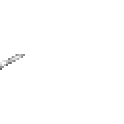

[打开 Aseprite 文件](../../assets/generated/vfx/element_bolt/source_candidates/bolt_projectile_neutral_candidate.aseprite)

### 直线电光（14 帧）

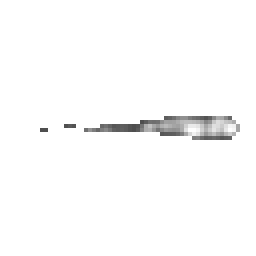

[打开 Aseprite 文件](../../assets/generated/vfx/element_bolt/source_candidates/bolt_straight_neutral_candidate.aseprite)

### 命中火花（8 帧）

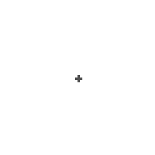

[打开 Aseprite 文件](../../assets/generated/vfx/element_bolt/source_candidates/hit_spark_neutral_candidate.aseprite)

## 元素狂怒

### 爆发核心（8 帧）

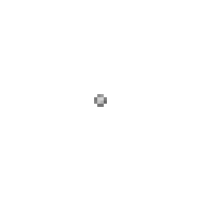

[打开 Aseprite 文件](../../assets/generated/vfx/elemental_fury/source_candidates/burst_core_neutral_candidate.aseprite)

### 冲击环（11 帧）

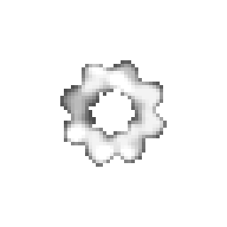

[打开 Aseprite 文件](../../assets/generated/vfx/elemental_fury/source_candidates/shock_ring_neutral_candidate.aseprite)

### 消散尾帧（10 帧）

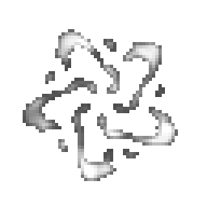

[打开 Aseprite 文件](../../assets/generated/vfx/elemental_fury/source_candidates/dissipate_neutral_candidate.aseprite)

## 元素激光

### 起点蓄力（8 帧）

[打开 Aseprite 文件](../../assets/generated/vfx/elemental_laser/source_candidates/origin_charge_neutral_candidate.aseprite)

### 命中脉冲（9 帧）

[打开 Aseprite 文件](../../assets/generated/vfx/elemental_laser/source_candidates/hit_pulse_neutral_candidate.aseprite)

## 元素回收

### 漩涡（13 帧）

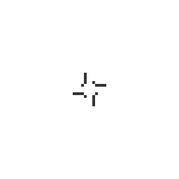

[打开 Aseprite 文件](../../assets/generated/vfx/element_reclaim/source_candidates/vortex_neutral_candidate.aseprite)

### 粒子环（9 帧）

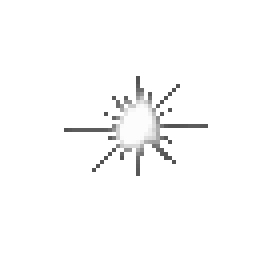

[打开 Aseprite 文件](../../assets/generated/vfx/element_reclaim/source_candidates/particle_ring_neutral_candidate.aseprite)

### 环绕粒子（10 帧）

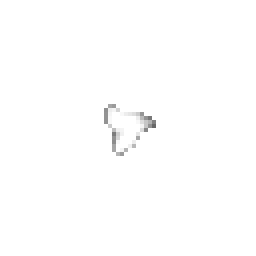

[打开 Aseprite 文件](../../assets/generated/vfx/element_reclaim/source_candidates/orbit_neutral_candidate.aseprite)

## 燃烧

### 火焰标记（10 帧）

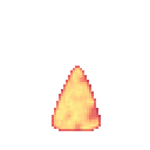

[打开 Aseprite 文件](../../assets/generated/vfx/burning/source_candidates/fire_marker_color_candidate.aseprite)

## 不息

### 涟漪（12 帧）

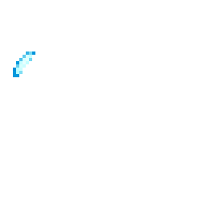

[打开 Aseprite 文件](../../assets/generated/vfx/unending/source_candidates/ripple_color_candidate.aseprite)

### 飞溅（11 帧）

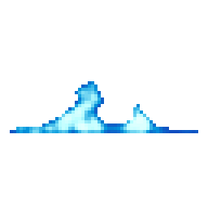

[打开 Aseprite 文件](../../assets/generated/vfx/unending/source_candidates/splash_color_candidate.aseprite)
